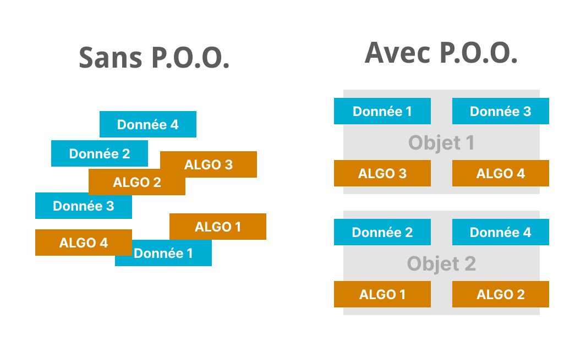
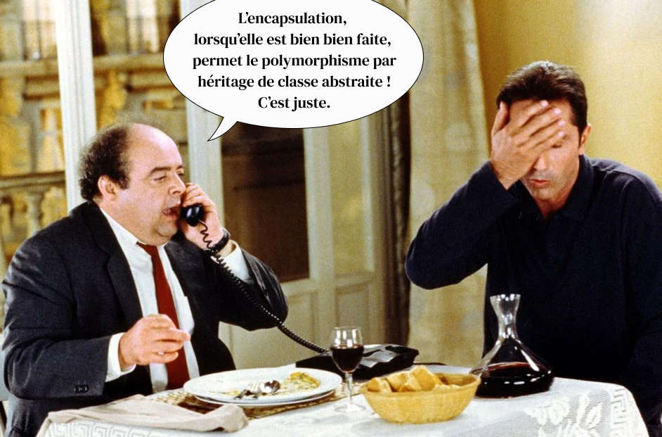
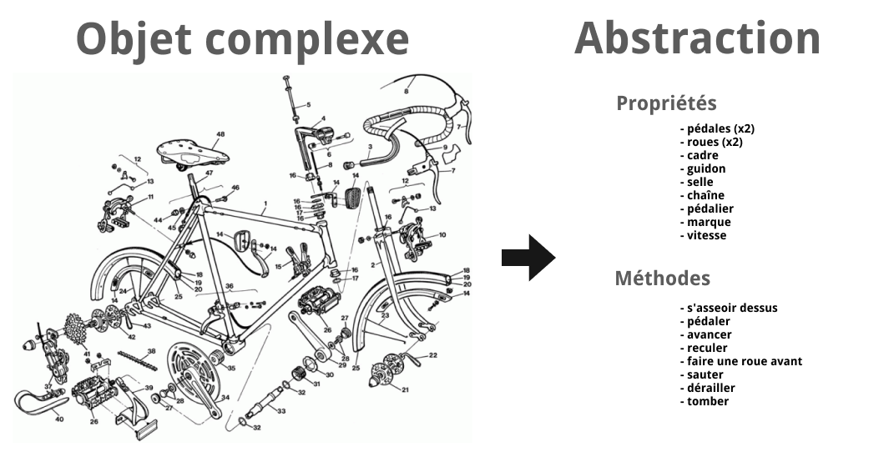
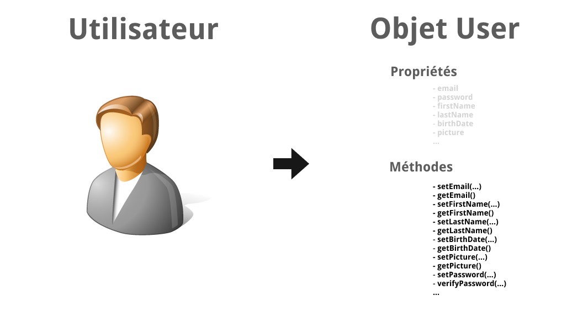
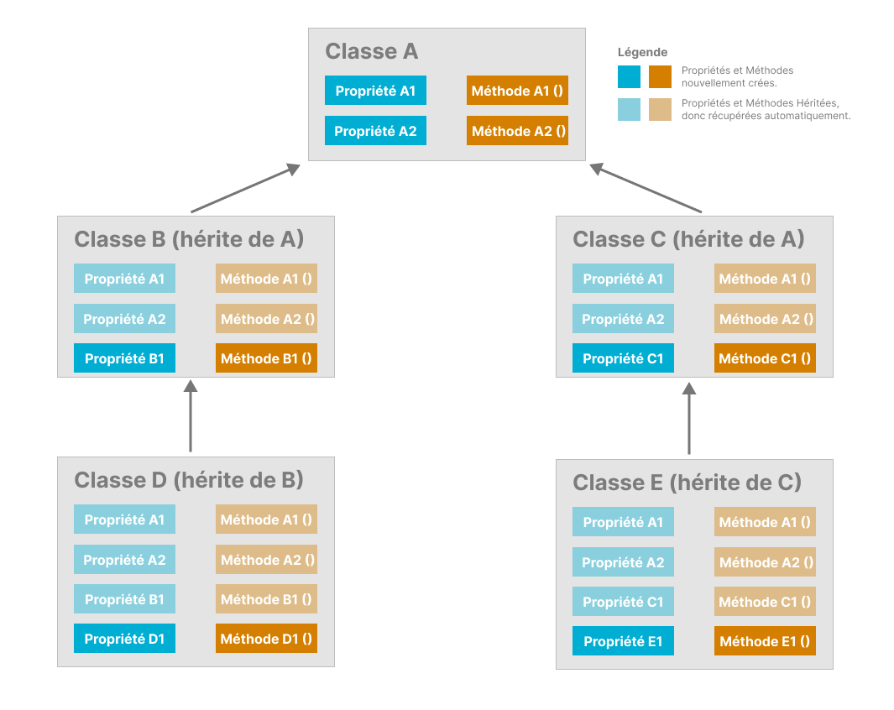
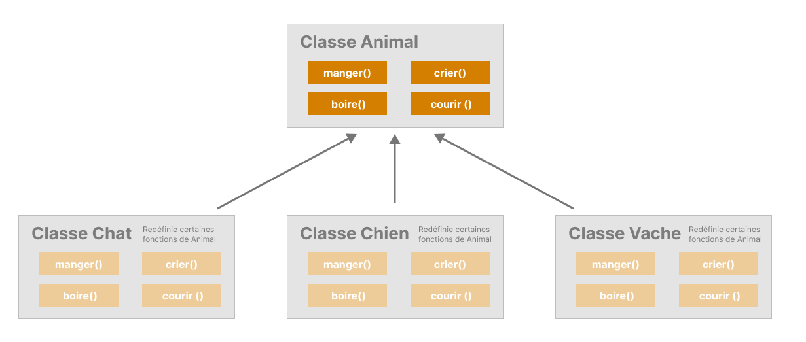
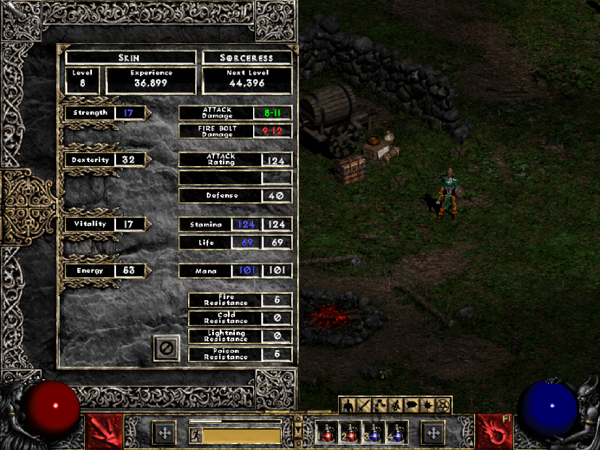
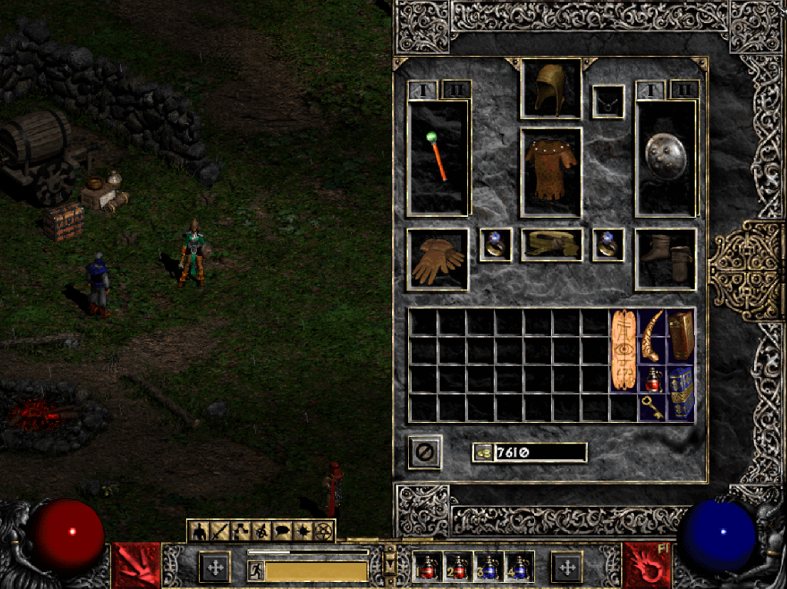

###### POO - programmation orientée objet
# La P.O.O.

## Théorie

La P.O.O., pour Programmation Orientée Objet, est un **paradigme de programmation**, une façon d'organiser son code si vous préférez. Celle-ci vise à **structurer le code en blocs logiques appelés "Objets"**, plutôt qu'en fichiers, fonctions ou blocs fonctionnels séparés de indépendants.

Avant la P.O.O., un algorithme devait prendre des données en entrée, les traiter et traduire un résultat en sortie.

En P.O.O. il va s'agir d'**enfermer toutes les données et tous les algorithmes traitants d'un même sujet à l'intérieur d'un objet**. L'objet ainsi créé peut représenter un concept virtuel tout aussi bien qu'un réel objet physique.



Ainsi, il est possible de créer des objets pour réprésenter :
- une voiture
- un chien
- un utilisateur
- un livre
- un évènement historique
- une planète 
- un personnage de jeu vidéo
- une équipe sportive
- une notion d'apprentissage
- ...

Bref. N'importe quelle idée, ou n'importe quel concept qui pourrait vous venir à l'esprit peut être représenté par un objet.

Et, vous connaissez déjà :

- le document HTML : ***"document"*** dans *"document.write()"* 
- la console javascript : ***"console"*** dans *"console.log()"*
- un tableau : ***"Array"*** dans *"new Array()"*
- la connection à une B.D.D : ***"PDO"*** de *"new PDO()"*
- une date : ***"Date"*** de *"new Date()"*

Et oui, vous utilisez déjà massivement la programmation objet depuis le début de votre apprentissage sans même le savoir.

## Mais alors comment ça marche ?

En P.O.O. on va prendre toutes les données relatives à un sujet - que l'on appelle alors ***"propriétés"*** - et toutes les fonctions qui y sont liées - que l'on appelle alors ***"méthodes"*** - et on va les enfermer dans une structure de code que l'on appelle **"la classe"**. En principe, dans un fichier dédié.

Prenons l'exemple d'un vélo. Celui-ci **se caractérise par** :
- pédales (x2)
- roues (x2)
- cadre
- guidon
- selle
- chaîne
- pédalier
- une marque
- sa vitesse

Ce sont les **propriétés de l'objet**. Des variables, ou des constantes, qui se trouvent dans l'objet et permettent de le représenter. On va les stocker dans une classe ***"Velo"*** .

Et, avec le vélo on peut **effectuer les actions suivantes** :
- s'asseoir dessus
- pédaler
- avancer
- reculer
- faire une roue avant
- sauter
- dérailler
- tomber

Ce sont les **méthodes de l'objet**. Des fonctions, en vérité, qui permettent l'utilisation et la manipulation de l'objet. On va également les stocker dans la classe ***"Velo"*** .

Notez comme les propriétés de l'objet sont toujours des noms communs, et les méthodes toujours des verbes.

Il devient alors possible d'écrire :

**En JavaScript :**
```JavaScript 
let monVelo = new Velo();
monVelo.marque = 'BTwin';
monVelo.avancer();
console.log(monVelo.vitesse):
```

**En PHP :**
```PHP 
$monVelo = new Velo();
monVelo->marque = 'BTwin';
monVelo->avancer();
echo monVelo->vitesse . '<br>':
```

## Les 4 cavaliers de la Programmation Orientée Objet

Alors, non, il ne s'agit pas de *Mort*, *Famine*, *Guerre* et *Conquête* - ceux-ci ne sont pas au programme de cette année - mais de **Abstraction**, **Encapsulation**, **Héritage** et **Polymorphisme** (*ndr : avec des termes pareils, vous allez pouvoir vous la péter pendant les dîner mondains !*).



### Abstraction

Le premier principe important de la P.O.O. l'abstraction, consiste à représenter virtuelement la chose que l'on souhaite traiter et à en simplifier, le plus possible, l'usage à l'utilisateur (ou à un autre développeur) en supprimant, ou en cachant, toute information superficielle pour ne garder que l'essentiel, ce qui est réellement utile pour le programme.

**Exemple d'abstraction :**


### Encapsulation

Second principe important de la P.O.O, **l'encapsulation est le fait de cacher certaines propriétés de l'objet** et de ne permettre d'atteindre celles-ci qu'au travers de méthodes prévues à cet effet.

Dis autrement,** les propriétés de l'objet ne sont pas directement accessible**s en lecture et en écriture, **il faut passer par des méthodes dédiées**.

Ceci permet par exemple, entre autres choses, de rendre une propriété impossible à modifier. On peut la lire, autant qu'on le veut, mais on ne peut pas la modifier. 

Autre exemple, l'encapsulation permet de vérifier que les valeurs fournies soient conformes et ne risquent pas de nuir à l'intégrité de l'objet, en vérifiant, par exemple, qu'une adresse email est bien une adresse email, ou qu'une date est bien une date, et dans les limites prévues en plus...

**Exemple d'objet représentant l'utilisateur d'un site :**



Ci-dessus, les propriétés de l'objet sont toutes *"cachées"* (*ndr : vous verrez plus tard comme faire cela*). 

Si l'on veut y accéder, on doit passer par les **méthodes** dédiées de type ***"setxxxx"*** ou ***"getxxxx"*** .

On appelle ces méthodes les ***"getters"*** et les ***"setters"*** , elles servent respectivement à récupérer la valeur de la propriété et à la définir.

Notez comme toutes les propriétés ont chacune un **getter** et un **setter** sauf le mot de passe *"password"* qui lui n'a que le *setter*. En effet, on peut définir un mot de passe, et éventuellement le modifier plus tard, mais on ne peut pas le récupérer, ce serait une abberation en terme de sécurité.

Tous les langages ne permettent pas l'encapsulation, vous verrez le moment venu comment procéder.

### Héritage

L'héritage est une notion un peu plus déliquate à saisir mais extrèmement puissante.

Il s'agit ici d'organiser les classes (donc les objets) en une **hiérarchie dans laquelle certaines classes *héritent* des propriétés et méthodes d'une classe parente**, laquelle peut, elle-même, éventuellement, hériter de certaines propriétés d'une classe encore au dessus, et ainsi de suite.

L'un des principaux avantages de cette méthode de programmation et la **réusabilité du code** puisque certaines propriétés et méthodes peuvent ainsi être partagées entre plusieurs objets différents, sans qu'il y est à redévelopper quoique ce soit.

**Voici un schéma explicatif de l'héritage en P.O.O. :**


Le schéma est explicite : **lorsqu'il y a héritage, les propriétés et méthodes de la classe parente *descendent* automatiquement à la classe enfant**, laquelle peut alors déclarer ses propres propriétés et méthodes en sus de celles qu'elle a récupéré.

Si nouvelle héritage il y a, l'ensemble de toutes ces propriétés et méthodes, nouvelles comme héritées, descendra à la nouvelle classe petit-enfant.

_Note :_ Il existe des instructions, dans certains langages, qui peuvent modifier ce comportement d'héritage normal, vous en verrez en PHP. Mais le principe de base, reste toujours le même.

_Note 2 :_ Comme vous avez dû le constater, les flèches semblent à l'envers sur le schéma. C'est une convention lorsque l'on représente l'héritage en P.O.O., on ne dit pas *"vers quelles classes filles se fait l'héritage depuis une classe mère"* mais *"de quelle classe mère hérite une classe fille"*.

### Polymorphisme

#### Définition

Le polymorphisme (*ndr: trop classe le nom !*) est un concept délicat. Dans le jargon c'est : "*Un concept de programmation consistant à fournir une interace unique à des entités pouvant, pourtant, être différentes*". Heu, et en en clair ?

#### Exemple de polymorphisme

Prenons une classe ***Vache***, certaines de ses méthodes pourraient-être :
- mangerDeLHerbe()
- mugir()
- boireDeLEau()
- courir()

Maintenant, la classe ***Chat*** :
- mangerDesSouris()
- miauler()
- boireDuLait
- courir()

Et enfin, la classe ***Chien*** :
- mangerDesCroquettes()
- aboyer()
- boireDeLEau()
- courir()

Tout ceci est correct, mais pas optimal.

Revenons sur notre définition plus haut *"...fournir une interace unique à des entités pouvant, pourtant, être différentes"*. **L'interface, en P.O.O., c'est l'ensemble des méthodes (fonctions) qui se trouvent à l'intérieur d'une classe**. Avec nos trois classes ci-dessus, et la liste de leurs méthodes respectives, nous avons donc trois interfaces différentes, puisque les noms des méthodes changent d'une classe à l'autre.

Si l'on veut respecter le principe de polymorphisme, il serait bien mieux d'écrire nos classes comme suit :

La classe ***Vache*** :
- manger(), *sous-entendu de l'herbe*
- crier(), *evidemment, la vache fera "Meuh !"*
- boire(), *sous-entendu de l'eau*
- courir()

La classe ***Chat*** :
- manger(), *sous-entendu des souris*
- crier(), *fera "Miaou !"*
- boire(), *sous-entendu du lait*
- courir()

La classe ***Chien*** :
- manger(), *sous-entendu des croquettes*
- crier(), *fera "Ouaf !"*
- boire(), *sous-entendu de l'eau*
- courir()

#### Mais pourquoi faire du Polymorphisme ?

Admettons que l'on ait créé un tableau `animaux[]` qui contiendrait des animaux de toute sorte et que l'on veuille faire une boucle pour tous leur faire pousser un cri. Voyons à quoi pourraient ressembler notre algorithme.

*Sans le polymorphisme :*

```
POUR CHAQUE animal DANS animaux[]
    SI type de animal EST "vache"
        animal.mugir()
    SINON SI type de animal EST "chat"
        animal.miauler()
    SINON type de animal EST "chien"
        animal.aboyer()
    FIN SI
FIN POUR 
```

*Et maintenant, avec polymorphisme :*

```
POUR CHAQUE animal DANS animaux[]
    animal.crier()
FIN POUR 
```

Ah, ben, c'est pas du tout la même ! On voit très clairement que c'est beaucoup, beaucoup plus simple avec le polymorphisme.

#### Mais encore

Il existe un autre très gros avantage au polymorphisme lorsqu'on le combine à l'héritage.

**Exemple :**



Dans l'exemple ci-dessus, les classes ***Chien***, ***Chat*** et ***Vache*** héritent toutes les trois de la classe parente ***Animal***. Elle récupèrent donc les propriétés et méthodes de celles-ci, qu'elle peuvent conserver tel quel ou modifier selon leurs besoins, on appelle le fait de modifier des méthodes héritées **la surcharge**.

Admettons maintenant que nous souhaitions créer une fonction pour nourrir chacun de ces animaux en utilisant un langage typé (C, JAVA, PHP7+, JavaScrit/TypeScript).

Sans polymorphisme on devrait créer une fonction pour chaque classe :

```
nourrirChat(Chat leChat){}
nourrirChien(Chien leChien){}
nourrirVache(Chien laVache){}
```
Chaque fonction étant spécialisée pour recevoir un type d'animal précis.

Grâce au polymorphisme et l'héritage combinés, il devient possible de créer une fonction comme-suite :

```
nourrir(Animal unAnimal){}
```

Cette fonction, pourra recevoir n'importe quelle classe, du moment qu'elle hérite de la classe ***Animal***. Cette fonctionnalité ne doit surtout pas être sous-estimée, c'est une des grandes forces de la P.O.O.

## Un exemple très complet

Ci-dessous, un exemple extrêmement poussé de programmation orientée objet.



Ceci est une capture d'écran du Jeu Diablo 2 sorti initialement en juin 2000. 

La fiche du personnage, contient l'ensemble des caractéristiques du personnage. Ce sont les propriétés de la classe.

De plus, le personnage est de type *"sorceress"*. Il existe d'autres types de personnages *"Fighter"*, *"Assassin"*... Ce sont probablement des classes qui héritent d'une classe mère *"Player"*, ou quelque chose du genre. Cette classe mère, possède toutes les propriétés communes à toutes les autres classes mais ces dernières redéfinissent ces propriétés selon leurs besoins.

**Et voici maintenant l'inventaire du personnage :**



L'inventaire du personnage lui-même respecte les principes de la P.O.O. il s'agit sans doute d'une propriété ***inventory[]*** qui est en réalité un tableau qui contient les objets de l'inventaire.

Là où cela devient fort, c'est que les objets de l'inventaire eux-mêmes sont des objets au sens P.O.O. du terme qui héritent probablement d'une classe mère **"Objet"**. Du coup, il devient possible d'ajouter un objet à l'inventaire et de retirer des objets de l'inventaire avec des fonctions génériques utilisant le principe de polymorphisme comme :

```
addToInventory(Objet unObjet);
removeFromInventory(Objet unObjet);
```

Voilà qui conclut notre introduction à la P.O.O..

Conservez bien ce document, il vous servira à réviser les concepts de la P.O.O. plus tard.

Vous allez maintenant passer à la pratique.